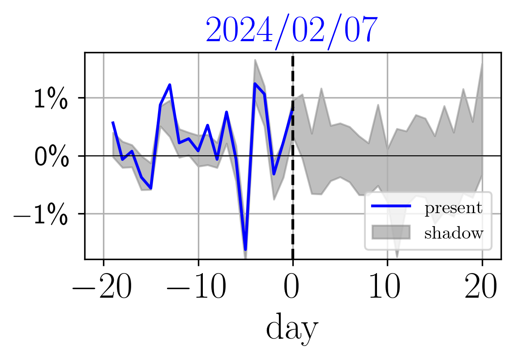

# Path Shadowing Monte Carlo

Implements Path Shadowing Monte Carlo [1], which can be used for volatility prediction and option pricing.

This methods averages future quantities over generated price paths (grey) whose past history matches, or `shadows', the actual observed history (blue).

For a quick start, see `tutorial.ipynb`

<p align="center">
    
</p>
<p align="center">
    <b>Path Shadowing: finding close paths in a generated dataset.</b>
</p>


## Installation 
The code requires python>=3.10. Run the commands below to install the required packages.

```bash
git clone https://github.com/RudyMorel/shadowing
cd shadowing/
python -m venv ~/venvs/shadowing
source ~/venvs/shadowing/bin/activate
pip install git+https://github.com/RudyMorel/scattering_spectra@v2.0.1
pip install -r exact_requirements.txt
```

## Path Shadowing 

On a given date, path shadowing involves scanning through generated price paths whose past history matches, or shadows, the actual observed past history (blue). These generated price paths can be produced using the Scattering Spectra model [2] with the script snp_generation.py.


```python
from scatspectra import SPDaily, TimeSeriesDataset
from shadowing import (
    PathShadowing, Identity, RelativeMSE, PredictionContext, plot_shadow
)

# current past history of SnP
snp = SPDaily()
dlnx_current = snp.dlnx[0,0,-20:]

# generated dataset  # can be generated using the script `generate_dataset.py`
dpath = Path("/path/to/your/generated/dataset")
dataset = TimeSeriesDataset(dpath, R=32768)  # dataset of 32768 long trajectories

# shadowing
embedding = Identity(dlnx_current.shape[-1])  # naive embedding
distance = RelativeMSE()  # distance in the embedding space 
obj = PathShadowing(
    embedding=embedding,
    distance=distance,
    dataset=dataset,
    context=PredictionContext(horizon=20),
)
distances, close_paths, _ = obj.shadow(
    dlnx_current,
    k=1024, # get the 1024 closest paths from the generated dataset
    cuda=True
)
plot_shadow(dlnx_current, distances[0,:], close_paths[0,:,:,:], eta=0.09, date=snp.dts[-1], color='blue');
```

<div align="center">
    
</div>
<p align="center">
    <b>Shadow of a path.</b>
</p>

## Volatility prediction

Once the closest paths have been collected, you can aggregate their future volatility 
with a weighted average, to obtain a volatility prediction. The weighted average 
gives more importance to paths that are close to the current one. 

```python
from shadowing import plot_volatility

Ts = np.array([5,10,20])  # the time scales at which we want to predict the volatility

# the function to apply to each path 
to_predict = lambda x: realized_variance(x, Ts=Ts, vol=False)[:,:,0,:]

# now aggreate predictions on the 1024 closest paths with a weighted average
vols, _ = obj.predict_from_paths(
    distances,
    close_paths,
    to_predict=to_predict,
    proba_name='softmax',
    eta=0.1,
)

# helper function for plotting vol predictions
plot_volatility(dlnx_current, (vols[-1,:] / 252) ** 0.5, Ts, date=snp.dts[-1], color='blue')
```

<div align="center">
    
</div>
<p align="center">
    <b>Volatility prediction obtained with Path Shadowing Monte Carlo.</b>
</p>

## Option pricing 

In the same way, one can price options on the collected close paths through 
Path Shadowing (hedged) Monte Carlo [3]

```python
from scatspectra import Softmax, PriceData, compute_smile

# averaging operator in Hedged HMC
ave = Softmax(distances[-1,:], eta=0.9)

# the shadowing paths extending the currently observed past
x = PriceData(dlnx=close_paths[-1,:,0,20:], x_init=100.0).x

# HMC on such shadowing paths
Ms = np.linspace(-2,2,9)
smile_conditional = compute_smile(x, Ts, Ms, ave=ave)

# plotting
_, ax = plt.subplots(1, 1, figsize=(4,3))
smile_conditional.plot(ax=ax, color='black', rescale=True, legend=True)
plt.xticks(fontsize=20); plt.yticks(fontsize=20)
plt.xlabel(r"$\mathcal{M}$", fontsize=20);
```

<p align="center">
    
</p>
<p align="center">
    <b>Option smile obtained through Path Shadowing (hedged) Monte Carlo.</b>
</p>

See `tutorial.ipynb` for more advanced examples.


[1] "Path Shadowing Monte Carlo" \
Rudy Morel et al. - https://arxiv.org/abs/2308.01486

[2] "Scale Dependencies and Self-Similar Models with Wavelet Scattering Spectra" \
Rudy Morel et al. - https://arxiv.org/abs/2204.10177

[3] "Hedged Monte-Carlo: low variance derivative pricing with objective probabilities" \
M. Potters, J.-P. Bouchaud, D. Sestovic - https://arxiv.org/abs/cond-mat/0008147


